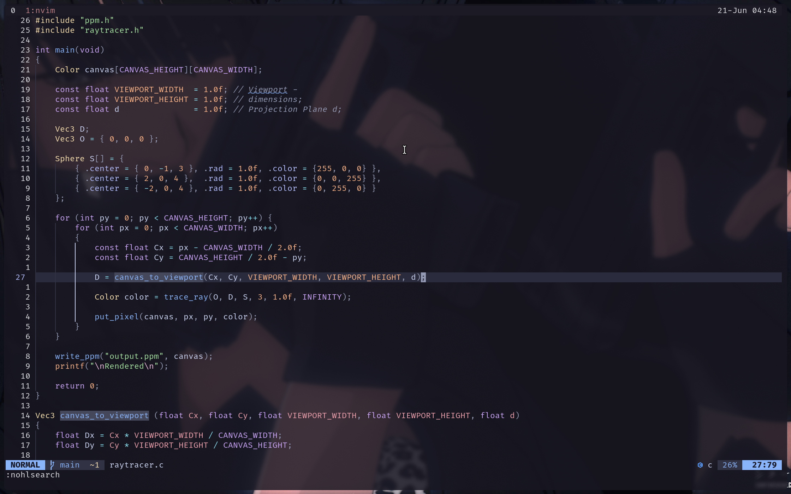
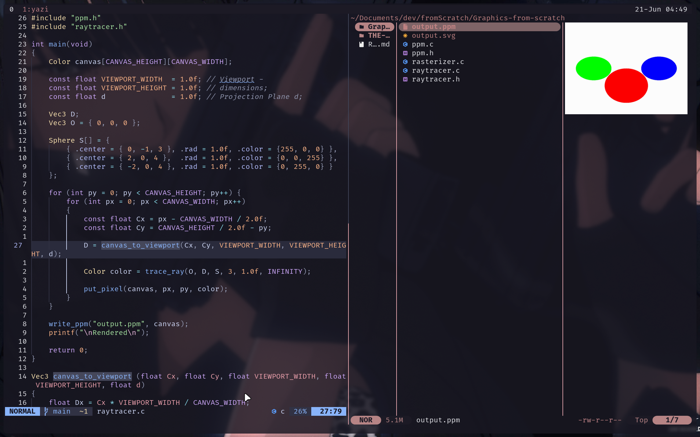

# nixos-dotfiles

NixOS 26.05 configuration for a single machine. Managed entirely through flakes — no mutable state outside `/nix/store` (except the Mango WM config, which is symlinked for live editing).

<p align="center">
  <br/>
  <sup>Mango WM overview mode</sup>
</p>

<p align="center">
  
  
</p>

<p align="center">
  
  
</p>

## What's Inside

- **Mango WM** — tiling Wayland compositor with live-reload config
- **Neovim** — 14 LSP servers, Conform formatting, custom plugins (tonycontext, docgen, tonysitter)
- **Catppuccin Mocha** — base theme generated via Stylix from wallpaper, with manual overrides in neovim/foot/starship
- **keyd** — Caps Lock remapped to Ctrl (hold) / Esc (tap)
- **Starship** — shell prompt with 16 modules (C, C++, Rust, Go, Zig, Lua, Perl, PHP, Node, Python, Nix, Docker, Git)
- **foot** — terminal emulator with transparent background
- **Mako** — notification daemon
- **Yazi** — terminal file manager
- **Zathura** — PDF viewer
- **fzf, zoxide, tmux** — shell tooling

## Requirements

- Single user setup (this config targets one machine, one user)
- Wayland-capable GPU (tested on AMD integrated)
- 4 GB RAM minimum for the base system (Mango WM, Neovim, foot, Zen browser) — additional packages will increase this
- 15–18 GB disk space depending on which user packages you include (GIMP, LibreOffice, etc. add significant size)

## Setup

```sh
git clone https://github.com/impeccableshoddy/nixos-dotfiles.git ~/nixos-dotfiles
cd ~/nixos-dotfiles
```

Three things to change before your first build:

1. **Hostname** — rename `hosts/oubliette-btw/` to your hostname, and update `hostname` in `flake.nix`
2. **Username** — rename `home/badmaster67/` to your username, and update `username` in `flake.nix`
3. **Hardware config** — replace `hosts/<your-hostname>/hardware-configuration.nix` with your own (generate it on the target machine with `nixos-generate-config`)

Then review `home/badmaster67/packages.nix` to add or remove user packages to your liking. Everything else is modular — system modules live in `modules/system/`, home-manager modules in `modules/home/`.

Note: `config/mango/config.conf` has the monitor hardcoded to `eDP-1` (laptop panel). If you're on a desktop or different display, adjust the `monitorrule` line to match your output name — check with `mangoctl outputs` and see the [Mango docs](https://github.com/mangowm/mango) for the format.

Build and apply:

```sh
sudo nixos-rebuild switch --flake ~/nixos-dotfiles#<your-hostname>
```

Reboot once. Mango WM will start automatically.

## Structure

```
.
├── flake.nix                        # Flake inputs & outputs
├── flake.lock
├── wallpapers/
├── hosts/
│   └── oubliette-btw/               # Machine-specific NixOS config
│       ├── default.nix
│       ├── configuration.nix
│       └── hardware-configuration.nix
├── modules/
│   ├── system/                      # NixOS system modules
│   │   ├── boot.nix                 # Bootloader (Limine), swap, GC
│   │   ├── desktop-mango.nix        # Mango WM, Thunar, autologin
│   │   ├── fonts.nix                # Fonts & cursor
│   │   ├── networking.nix           # NetworkManager, iwd, firewall, DNS
│   │   ├── services.nix             # keyd, Bluetooth, backlight
│   │   ├── stylix.nix               # Base theme (color generation from wallpaper)
│   │   └── users.nix
│   └── home/                        # Home-manager modules
│       ├── neovim.nix               # Neovim plugins & LSP servers
│       ├── starship.nix             # Prompt
│       └── tmux.nix                 # Tmux + vim-tmux-navigator
└── home/
    └── badmaster67/
        ├── default.nix              # Home-manager entry point
        ├── packages.nix             # User packages
        ├── shell.nix                # Bash, fzf, zoxide
        ├── wayland.nix              # Mako, screenshot/recording tools, Mango symlink
        └── programs/
            ├── foot.nix             # Terminal emulator
            ├── git.nix
            ├── yazi.nix             # File manager
            └── zathura.nix          # PDF reader
```

## Window Manager

[Mango](https://github.com/mangowm/mango) — a tiling Wayland compositor. Config lives at `config/mango/config.conf` and is symlinked into `~/.config/mango` so edits take effect on reload (`Super+r`).

Keybind groups: core launches (`Super+Return/Space/e/c/w/s`), tag management (`Super+1-9`, `Super+Shift+1-9`), layout switching (`Super+t/v/x`), window focus (`Super+h/j/k/l`), swap (`Super+Shift+h/j/k/l`), media keys (`F10/F11/F12` for playerctl), and more. See `config.conf` for the full map.

## Editor

Neovim with Lua config, LSP for 14 languages, Conform formatting, and custom plugins. See [`config/nvim/README.md`](config/nvim/README.md) for keybinds, plugins, and more.

## Apply

```sh
# Rebuild
sudo nixos-rebuild switch --flake ~/nixos-dotfiles#oubliette-btw

# Update flake inputs + rebuild
nix flake update --flake ~/nixos-dotfiles && sudo nixos-rebuild switch --flake ~/nixos-dotfiles#oubliette-btw
```

Shell aliases `nrb` and `nup` are provided for these.

## Inputs

| Input | Purpose |
|---|---|
| nixpkgs (nixos-26.05) | System packages |
| nixpkgs-unstable | Unstable overlay (allowUnfree) |
| home-manager | User package management |
| stylix | Color generation from wallpaper |
| mango | Window manager |
| zen-browser | Browser |
