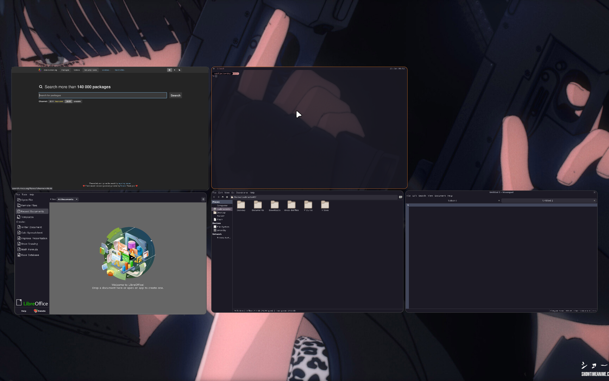
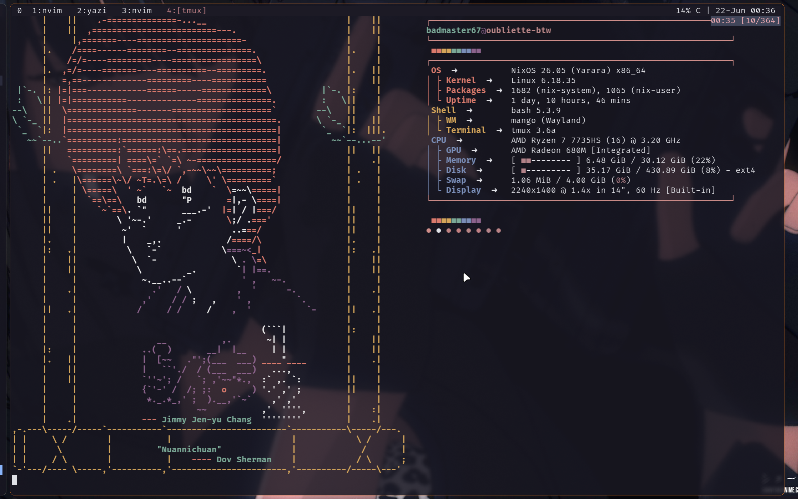
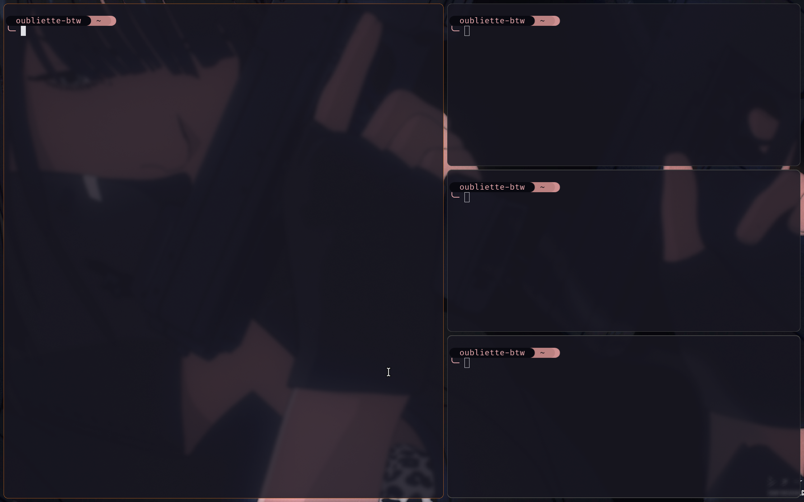
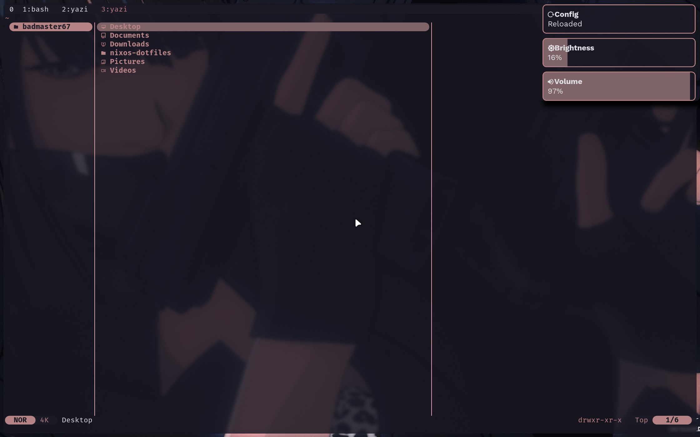

# nixos-dotfiles

NixOS 26.05 flake config for a single machine. Everything is declarative except two files that are symlinked for live editing — the Mango WM config and the Fastfetch config.jsonc — because I want to tweak those without a rebuild.

This is my daily driver built from scratch after switching from [Omarchy](https://github.com/basecamp/omarchy) (DHH's Arch + Hyprland setup) for 7+ months. Purely due to giving in to the hype around NixOS, and a fatal disease for man known as too much time at hand. MangoWM got pulled in the middle being the new hot girl in town after months of being stuck with Hyprland. Neovim config written around custom plugins from [tony-btw](https://github.com/tonybanters), and wired up with a coloring pipeline that goes from wallpaper → Stylix → manual overrides → Fastfetch.

This was never designed as a starter kit or a copy-paste ricing setup. It's a personal daily driver built to improve my workflow first and foremost. If you can derive any value from this on top of that, then that's a plus in my book.

<p align="center">
  <br/>
  <sup>Mango WM overview mode</sup>
</p>

<p align="center">
  <br/>
  <sup>Ranma in the termmmm</sup>
</p>

<p align="center">
  <br/>
  <sup>Window tiling and notifications</sup><br/>
  
</p>

## What I Use

### Window Manager

[Mango WM](https://github.com/mangowm/mango) — a tiling Wayland compositor built on dwl (itself a dwm port to wlroots). I found it randomly and it looked cool and I just genuinely wanted to try it and experience something other than Hyprland, which I had previously experienced via omarchy. The entire config is 206 lines and reloads live on `Super+r` since it's symlinked.

Mango has its own [ArchWiki page](https://wiki.archlinux.org/title/MangoWM). The upstream README describes it as "dwm for Wayland, but actually usable" — it keeps dwl's lightweight single-binary philosophy while adding the features that make a compositor work day-to-day: smooth animations (window open/move/close, tag transitions), window effects via scenefx (blur, shadows, corner radius), a built-in overview mode (hycov-style), a sway-like scratchpad, and the scroller layout as a first-class option alongside the usual tiling, vertical etc. Per-tag layout assignment means you can run tag 3 on scroller while everything else stays on tile.

Both Mango and Hyprland use the same external tools for the desktop shell — bars (waybar), launchers (rofi/fuzzel), notifications (mako/swaync), screenshots (grim/slurp), clipboard (cliphist/wl-clipboard), and lock screens (swaylock). The difference is in the compositor itself: Hyprland is a larger independent wlroots compositor with its own plugin system and Hyprlang config format, while Mango is a dwl fork with a simple `key=value` config, no plugin system, and a smaller codebase that builds in seconds. If you've used dwm or dwl, Mango feels familiar — one binary, one config file, everything else is standard Wayland tools you wire yourself.

### Coloring Pipeline

The coloring system ties the wallpaper to every visual element in the desktop — terminal, prompt, editor, and system info display — through a pipeline that goes through Stylix for base generation, then gets overridden per-application where needed.

```
wallpapers/girl.jpg
        │
        ▼
    Stylix          ← generates base Catppuccin Mocha palette from the wallpaper
        │              and applies it to everything: GTK, cursor, QT, etc.
        ▼
    Manual overrides ← starship prompt uses a custom "girl" palette
        │                Neovim uses Catppuccin Mocha (via catppuccin-nvim plugin)
        │                foot terminal inherits Stylix but I can override
        │                Fastfetch uses $N color tokens (see below)
        ▼
    Fastfetch $1-$5  ← ANSI color tokens that match the wallpaper colors exactly
```

The Fastfetch config uses numbered color tokens (`"1"` through `"5"`) in the `logo.color` block instead of named ANSI colors. This solves the alignment-breaking problem that happens when you mix full ANSI escape sequences like `\x1b[38;2;R;G;Bm` with regular text — the escape bytes get counted as visible characters by most terminal emulators, pushing everything out of alignment. By defining colors as numbered tokens in the JSON schema, Fastfetch handles the length calculation internally and everything lines up.

Starship uses its own custom `girl` palette with six named colors (ink, slate, rose, taupe, blush, deepred) that I picked to complement the Stylix output. The prompt format stacks hostname → directory → git → language modules left to right with powerline-style separators.

### Neovim

The editor config is the deepest part of this repo. See [`config/nvim/README.md`](config/nvim/README.md) for full keybinds and plugin docs — here I'm covering the architecture and the decisions.

**Plugin ecosystem (5 custom, from [tony-btw](https://github.com/tonybanters)):**

| Plugin | Lines | What it does |
|--------|-------|-------------|
| tonysitter | 108 | Treesitter highlight/indent wiring, `downcase!`/`upcase!` query directives, `af`/`if` function text objects |
| tonycontext | 110 | Sticky context header (replaces treesitter-context). Shows enclosing function signature when it scrolls out of view |
| docgen | 222 | Docstring scaffolding for C (kernel-doc), Go, Rust, Python — generates the skeleton above the cursor |
| quickformat | 40 | Reformats single-line parenthesized content into multi-line layout |
| flterm | 55 | Persistent floating terminal that preserves its buffer across toggles |

I made minor modifications to these from tony-btw's originals — mainly adapting the indent wiring in tonysitter to work with the current nvim-treesitter API (more on that below).

**LSP setup:** All 14 servers are configured via Neovim 0.12+'s native `vim.lsp.config` API. `nvim-lspconfig` is installed in the plugin list but only for `cmp_nvim_lsp` capabilities — no per-server setup calls, no lazy loading, no lspconfig configs. Every server is declared in one file with `filetypes`, `root_markers`, `cmd`, and `capabilities`, then bulk-enabled at the bottom with a loop over `vim.lsp.config._configs`. This is the API Neovim is standardizing on, so it's forward-compatible.

**Treesitter queries:** 6,313 lines across 12 query directories covering highlights, textobjects, and injections. These live in `config/nvim/queries/` and get loaded via Neovim's runtime path. The Rust highlights alone are 531 lines — these cover things the upstream queries miss or handle differently.

**Indentation — what actually works and what doesn't:**

The nvim-treesitter plugin rewrote its API on the `main` branch. The old `require("nvim-treesitter").setup({indent = {enable = true}})` is dead code — `setup()` now only handles `install_dir`, and the `indent` key is silently ignored. So we wire indentation manually in tonysitter's FileType autocmd:

```lua
local lang = vim.treesitter.language.get_lang(vim.bo[args.buf].filetype)
if lang and vim.treesitter.query.get(lang, "indents") then
  vim.bo[args.buf].indentexpr = "v:lua.require'nvim-treesitter'.indentexpr()"
end
```

This only activates for languages that have `indents.scm` query files (bundled with nvim-treesitter via `withAllGrammars`). Languages without indent queries fall back to Vim's built-in `autoindent`, which just copies the previous line's whitespace — it has zero awareness of syntax or scope.

**Formatting — three paths, and why they can fight each other:**

There are three completely separate formatting mechanisms, and understanding which one fires when is important:

1. **`<leader>cf` (Conform)** — spawns external formatter binaries (stylua, black, prettierd, clang-format, etc.) with explicit args. This is the one I use. Conform's `prepend_args` tells clang-format to use 4-space indent, matching Neovim's `shiftwidth`.

2. **`<leader>ct` + save (Conform format_on_save)** — same as above but automatic on write. Off by default, toggled with `<leader>ct`.

3. **`<F3>` (LSP format)** — sends a `textDocument/formatting` request to the attached language server. For C/C++, clangd runs clang-format internally with its own default style (LLVM = 2-space indent). This path ignores Conform's `prepend_args` entirely. I excluded C/C++/PHP from the BufWritePre auto-format to avoid this conflict.

The mismatch between Conform's clang-format (4-space, via prepend_args) and clangd's clang-format (2-space, via LLVM default) is why F3 in C files will format to 2-space indent while Neovim's shiftwidth is 4. I use `<leader>cf` for C files to keep them consistent. If you want F3 to also give 4-space, add `--fallback-style={BasedOnStyle: LLVM, IndentWidth: 4}` to clangd's cmd — or drop a `.clang-format` file in your project root.

**What breaks if you just clone and build:**

- The hostname `oubliette-btw` and username `badmaster67` are hardcoded in `flake.nix` and directory structure. You need to rename both.
- `config/mango/config.conf` has `eDP-1` hardcoded as the monitor. Check your output name with `mangoctl outputs` and change it.
- `home/badmaster67/packages.nix` has personal package choices. Review it — there might be things you don't need or things missing.
- The wallpaper at `wallpapers/girl.jpg` is referenced by Stylix. If it doesn't exist, the color pipeline breaks. Drop your own wallpaper there.
- Fastfetch configs reference logo files (`nuannichuan.txt`, `nuannichuan_colored.txt`, `cat-fu.txt`, `dizziness.txt`). They're included in the repo so they'll work out of the box. Only `nuannichuan_colored.txt` uses ANSI color sequences — the rest are plain text art. Replace them with your own if you want.
- `initLua` in `modules/home/neovim.nix` uses an absolute path (`/home/${username}/nixos-dotfiles/config/nvim`). The username substitution handles the user part, but the repo path (`nixos-dotfiles`) is assumed. If you clone to a different directory name, update `neovim.nix`.
- This is tested on a single machine (laptop with AMD integrated graphics). Desktop GPU, multi-monitor, or different hardware may need tweaks to Mango WM config or hardware-configuration.nix.

## Setup

```sh
git clone https://github.com/impeccableshoddy/nixos-dotfiles.git ~/nixos-dotfiles
cd ~/nixos-dotfiles
```

**Three things to change before your first build:**

1. **Hostname** — rename `hosts/oubliette-btw/` to your hostname, update `hostname` in `flake.nix`
2. **Username** — rename `home/badmaster67/` to your username, update `username` in `flake.nix`
3. **Hardware config** — replace `hosts/<your-hostname>/hardware-configuration.nix` with your own (generate with `nixos-generate-config` on the target machine)

Then review `home/<your-username>/packages.nix` for packages you want to add or remove.

Build and apply:

```sh
sudo nixos-rebuild switch --flake ~/nixos-dotfiles#<your-hostname>
```

Reboot once. Mango WM starts automatically via autologin.

## Structure

```
.
├── flake.nix                        # Flake inputs & outputs
├── flake.lock
├── wallpapers/
├── config/                          # Live-edited configs (symlinked, not managed by Nix)
│   ├── mango/                       # WM config + scripts (smart-snip, screenshot, wp-chooser)
│   ├── fastfetch/                   # Config, logo art, color token definitions
│   └── nvim/                        # Neovim runtime config
│       ├── init.lua                 # Entry point
│       ├── lua/config/              # options.lua, keybinds.lua
│       ├── lua/plugins/             # ui, editor, telescope, completion, tools
│       ├── plugin/                  # Auto-sourced: lsp, tonysitter, tonycontext, docgen, flterm, quickformat
│       ├── after/ftplugin/          # Filetype overrides (nix, hare, man, jsonc, goon)
│       └── queries/                # Custom Treesitter queries (6,313 lines, 12 directories)
├── modules/
│   ├── system/                      # NixOS system modules
│   │   ├── boot.nix                 # Bootloader (Limine), swap, GC
│   │   ├── desktop-mango.nix        # Mango WM, Thunar, autologin
│   │   ├── fonts.nix                # JetBrainsMono, Work Sans, EB Garamond
│   │   ├── networking.nix           # NetworkManager, iwd, firewall, DNS
│   │   ├── services.nix             # keyd (Caps→Ctrl/Esc), Bluetooth, backlight
│   │   ├── stylix.nix               # Color generation from wallpaper, opacity, fonts
│   │   └── users.nix
│   └── home/                        # Home-manager modules
│       ├── neovim.nix               # Plugin declarations, LSP servers, formatters, initLua
│       ├── starship.nix             # Prompt with custom "girl" palette
│       └── tmux.nix                 # Tmux + vim-tmux-navigator
├── hosts/
│   └── oubliette-btw/               # Machine-specific NixOS config
│       ├── default.nix              # Imports all system modules
│       ├── configuration.nix        # System-level settings
│       └── hardware-configuration.nix
└── home/
    └── badmaster67/
        ├── default.nix              # Home-manager entry point
        ├── packages.nix             # User packages (apps, dev tools, GUI programs)
        ├── shell.nix                # Bash, fzf, zoxide, aliases (nrb, nup)
        ├── wayland.nix              # Mako, screenshot/recording scripts, Mango symlink
        └── programs/
            ├── foot.nix             # Terminal (transparent, Stylix-colored)
            ├── git.nix              # Git config
            ├── yazi.nix             # File manager with custom rules
            ├── zathura.nix           # PDF reader
            └── fastfetch.nix         # Fastfetch + symlink
```

## Rebuild & Update

```sh
# Rebuild
sudo nixos-rebuild switch --flake ~/nixos-dotfiles#oubliette-btw

# Update flake inputs + rebuild
nix flake update --flake ~/nixos-dotfiles && sudo nixos-rebuild switch --flake ~/nixos-dotfiles#oubliette-btw
```

Shell aliases `nrb` and `nup` are provided for these.

## Flake Inputs

| Input | Purpose |
|---|---|
| nixpkgs (nixos-26.05) | System packages |
| nixpkgs-unstable | Unstable overlay (allowUnfree) |
| home-manager | User package management |
| stylix | Color generation from wallpaper |
| mango | Window manager |
| zen-browser | Browser |
